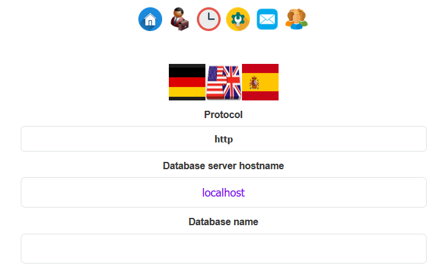
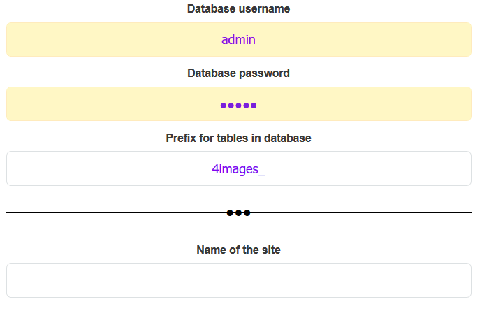
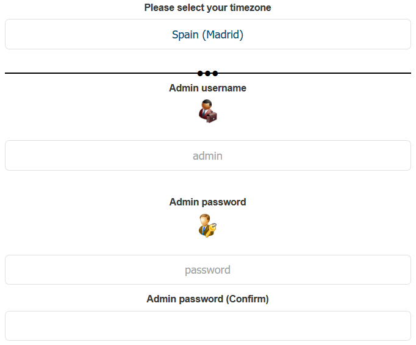
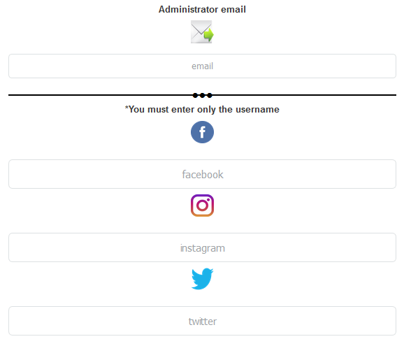
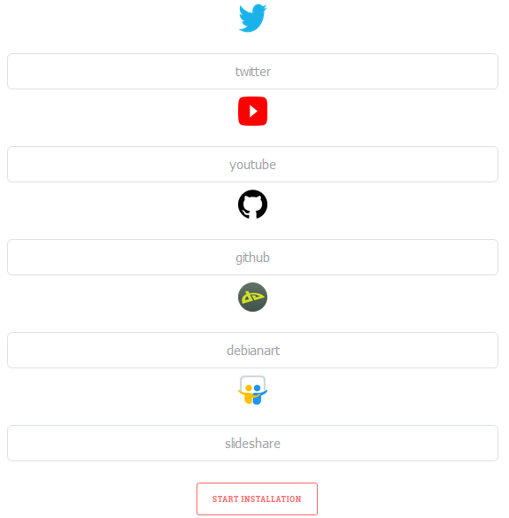

# CMS 4images-UPDATED

## What is 4 images?

- 4images -updated is an improvement of 4images, that is, an image manager. It consists of user registration as well as internal messages among other improvements

## Programming languages / Frameworks

- BOOSTRAP

- CSS

- JQUERY

- JS 

- PHP

- MYSQLI

## How do I install it?

- Once downloaded, paste the cms on your web server. Access the cms from the browser by accessing the install.php file in the image manager folder

- The installation is very simple. Simply fill in the configuration of the database and the CMS administrator account. The other fields are optional.

